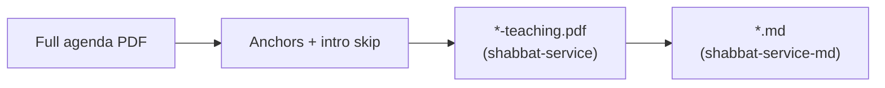

## The LMM Parse Project
Help me plan an app that will parse a PDF and save portions of if into MarkDown
- The PDF is an agenda for our congregation (LivingMessiah.com) that is created every Saturday
- It is uploaded in an Azure Blob Storage located here `https://livingmessiahstorage.blob.core.windows.net/shabbat-service/`
- the file name format of the PDF name starts with the date (YYYY-MM-DD) then a hyphen, then a citation in the Torah e.g. `2026-07-04-Lev-16.pdf` here's another one `	2026-06-06-Lev-12-1-to-13-28.pdf`
- I'm only interested in the part that starts after the "Welcome" and the next line under that is "Bienvenido".  The end of the desired content is before the page titled "The Avinu Prayer".
- Most of that content is Bible verses with some supporting commentary and a few images
- I want that content to be saved in another folder `https://livingmessiahstorage.blob.core.windows.net/shabbat-service-md/` with the same name except ending in `.md` instead of .`pdf`

## About Me
I want the project saved in GitHub under my Github account `https://github.com/JohnMarsing`

I'm a c# developer with excellent knowledge in building Blazor Web Apps, Azure, and Sql Server. Also very good with Console and Azure Functions (to some degree). 

I'm open to options to various solutions but in the end I want a project I can understand

I'm new to Grok Build as this is my first solution using this tool, so help along the way would be useful

# Prompt 2
- [PdfPig](https://github.com/UglyToad/PdfPig)
- In the .md files, remember the pages of the PDF that the content came from

---

## Status (where we are)

v1 CLI through Azure blob → Markdown is **done** (design PRs 1–5). See `README.md` and `docs/design-lmm-parse-pdf.md`.

| Piece | Status |
|-------|--------|
| Models / options | Done |
| PdfPig extract + anchors + intro skip | Done |
| Markdown builder | Done |
| CLI local mode | Done |
| Azure blob I/O (`--blob` → `.md`) | Done |
| **Azure Function blob trigger (PR 7)** | **Done** (thin host; skips *-teaching.pdf) |
| **Teaching-only PDF (workflow step 1 / PR 8a)** | **Done** (slice + local/blob write) |
| Markdown from teaching PDF (PR 8b) | Next |

---

## Next: Teaching PDF as step 1 of the workflow (locked)

### Goal

Produce a **smaller PDF** that contains **only the teaching/study page range**, then run **Markdown extraction against that teaching PDF** so the MD step no longer has to locate Welcome / Avinu / intro-skip on the full agenda.

### Locked decisions

| # | Decision | Choice |
|---|----------|--------|
| 1 | **When it runs** | **First step** in the workflow. Markdown uses `*-teaching.pdf` as its source. |
| 2 | **Local output** | Teaching PDF next to the Markdown output (same local folder). |
| 3 | **Azure output** | Teaching PDF goes in the **same container as the source**: `shabbat-service`. |
| 4 | **Skip** | Reuse `--skip-existing` for the teaching blob/file as well as MD. |
| 5 | **Overwrite** | Default **overwrite** (same as MD today). |

### Naming

| Role | Example |
|------|---------|
| Full agenda (input) | `2026-07-04-Lev-16.pdf` |
| Teaching PDF (step 1 output) | `2026-07-04-Lev-16-teaching.pdf` |
| Markdown (step 2 output) | Prefer keep historical name: `2026-07-04-Lev-16.md` (strip `-teaching` when deriving MD name) |

Rule: `{BaseNameWithoutExtension}-teaching.pdf`  
e.g. `2026-06-06-Lev-12-1-to-13-28-teaching.pdf`

### Two-step pipeline

```text
Step 1 — Slice teaching PDF (needs full agenda + anchors)
  Source:  shabbat-service / YYYY-MM-DD-Citation.pdf   (or local full PDF)
  Detect:  Welcome + Bienvenido → intro skip → end before "The Avinu Prayer"
  Write:   shabbat-service / YYYY-MM-DD-Citation-teaching.pdf
           (local: same folder as eventual .md)

Step 2 — Markdown from teaching PDF (no full-agenda anchors)
  Source:  *-teaching.pdf  (local path or blob already produced in step 1)
  Content: entire teaching PDF (all pages are teaching content)
  Write:   shabbat-service-md / YYYY-MM-DD-Citation.md  (or local .md)
```



### Why step 2 can drop anchor parsing

- Step 1 already chose `ContentStartPage`…`ContentEndPage` on the **full** PDF.
- The teaching PDF is a **page-range copy** of only those pages.
- Step 2 treats **every page** of `*-teaching.pdf` as content (no Welcome / Avinu required on that file).

Anchors remain **only** on step 1 (full agenda).

### CLI / operator flow (intent)

**One run can do both steps** (default happy path):

```powershell
# Full agenda blob → teaching PDF in shabbat-service → MD in shabbat-service-md
dotnet run --project src/LivingMessiah.ShabbatPdf.Cli -- --blob "2026-07-04-Lev-16.pdf"
```

**Local:**

```powershell
dotnet run --project src/LivingMessiah.ShabbatPdf.Cli -- `
  --input "C:\...\2026-07-04-Lev-16.pdf" `
  --output "C:\...\out\2026-07-04-Lev-16.md"
# also writes C:\...\out\2026-07-04-Lev-16-teaching.pdf
```

**Skip / overwrite:**

- Default: overwrite teaching PDF and MD if they already exist.
- `--skip-existing`: if teaching PDF already exists, **reuse it** for step 2 (do not re-slice); if MD already exists, skip MD write. Exact flag semantics to nail in implementation (per-artifact skip vs all-or-nothing).

Optional later flags (not required for first cut):

- `--teaching-only` — stop after step 1  
- `--from-teaching` — step 2 only (input is already `*-teaching.pdf`)

### Technical notes (for implementation)

- **PdfPig** can import pages: `PdfDocumentBuilder.AddPage(sourceDocument, pageNumber)` for each page in range.
- Reuse existing `AnchorLocator` / intro skip for step 1 only.
- New piece: `TeachingPdfWriter` (name TBD) — copy page range to new PDF bytes/file.
- `FilenameParser`: helpers for `TeachingPdfFileName` and for stripping `-teaching` when computing MD name / citation.
- Azure: upload teaching blob to **source** container (`shabbat-service`); MD stays on **destination** container (`shabbat-service-md`).
- May need `IBlobStore.UploadBinary` / download helpers if today only text upload exists for MD.

### Page numbers in Markdown (locked)

**Choice A — teaching-relative pages (simplest).**

- After slicing, teaching PDF pages are **1…N**.
- Markdown page comments (`<!-- page N -->`) and front-matter page range use **those teaching-PDF page numbers**, not original full-agenda numbers (e.g. not 88–113).
- No mapping back to full-agenda page numbers in v1 of this workflow.

### Suggested PR slice

| PR | Title | Scope |
|----|-------|--------|
| **PR 8a** | `feat: export teaching-only PDF page slice` | Writer, naming, local + blob write to `shabbat-service`, tests; CLI step 1 |
| **PR 8b** | `feat: Markdown from teaching PDF source` | Step 2: whole-doc content (no anchors on teaching file); wire pipeline order; skip-existing per artifact; docs |

Or one PR if kept small and reviewed together.

### Explicit non-goals for this next work

- Multi-column layout / two-column ContentLines  
- OCR  
- Rebuilding a PDF from Markdown  
- Azure Function (still PR 7, separate)

### Related scratch ideas (not this PR)

- Auth / Managed Identity for Function (PR 7)  
- Optional two-column ContentLines (v2 research only)  
- Filename discovery from livingmessiah.com/WeeklyDownload  

---

## Historical: PR 2 (done)

### PR 2 — PdfPig extraction, anchors, intro skip
- **PR title:** `feat: extract PDF text lines with anchors and intro skip`
- **Files:** `PdfPigPageSource`, `LineClusterOptions`, `AnchorLocator`, `ContentSlicer`, fixtures, tests
- **Dependencies:** PR 1
- **Description:** midY line clustering only; start/end anchors; intro skip; pin PdfPig. Prefer text-rich PDF for content goldens; synthetic fixtures for Avinu fallbacks. **No** multi-column code. No multi‑MB PDFs in git.
