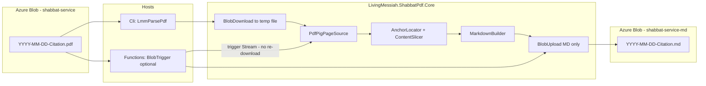
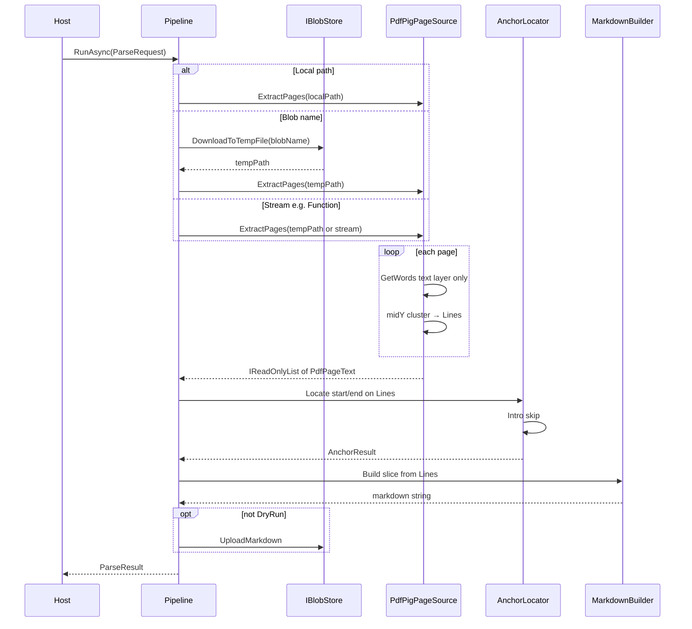
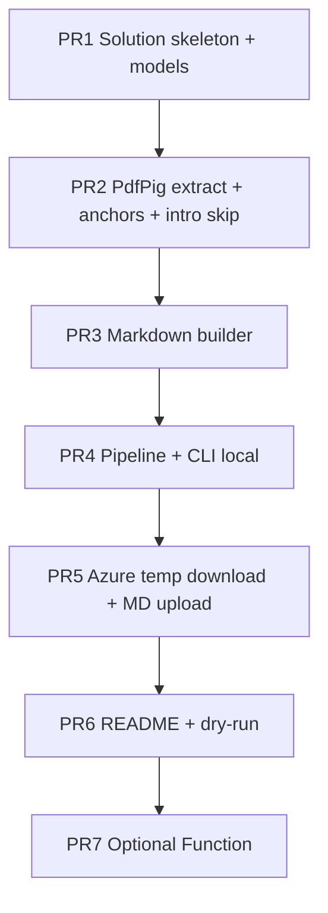

# LMM Parse PDF → Markdown

| Field | Value |
|-------|-------|
| **Author** | John Marsing |
| **Date** | 2026-07-10 |
| **Status** | **Approved (user decisions locked; layout scope simplified)** |
| **Repo (intended)** | https://github.com/JohnMarsing/LMM-Parse-PDF |
| **Workspace** | `C:\Source\repos\LMM-Parse-PDF` |

---

## Overview

Every Saturday, Living Messiah Ministries produces a multi-page Shabbat service agenda PDF and uploads it to Azure Blob Storage (`shabbat-service`). The congregation needs a **machine-readable Markdown excerpt** of the teaching/study portion of that agenda—starting after the bilingual “Welcome / Bienvenido” slide, **skipping known intro slides** (Fair Use / “What will we talk about today?”), and stopping before “The Avinu Prayer”—written to a **private** sibling container (`shabbat-service-md`) with the same base filename and a `.md` extension.

This design proposes a **small, understandable .NET 8 (`net8.0` LTS) solution**: a **shared core library** (PDF text extract + Markdown build + blob I/O), a **Console CLI** as the **only** production host for v1 (**manual run after upload**), and an **optional Azure Function** later. Load is ~1 PDF per week; **simplicity beats scale**.

**v1 extracts only the PDF text layer** (words that PdfPig can read as text). Text that exists only as pixels inside images is **not** extracted (no OCR). **Images themselves are skipped in v1**; a later version may save each image in the extract range.

**Layout recovery (multi-column / two-column reordering) is out of scope.** Pages are normalized with a simple full-page line cluster (word midY → lines left-to-right, top-to-bottom). That is enough for anchors and for decks whose teaching content is real text. Prefer validating and building goldens against agendas that hold scripture/commentary as selectable text—not primarily as screenshots.

---

## Background & Motivation

### Current state

| Item | Detail |
|------|--------|
| Source container | `https://livingmessiahstorage.blob.core.windows.net/shabbat-service/` |
| Destination container | `https://livingmessiahstorage.blob.core.windows.net/shabbat-service-md/` |
| Naming | `YYYY-MM-DD-{TorahCitation}.pdf` → `YYYY-MM-DD-{TorahCitation}.md` |
| Examples | `2026-07-04-Lev-16.pdf`, `2026-06-06-Lev-12-1-to-13-28.pdf` |
| Upload path today | Living Messiah Admin / RCL already uploads PDFs via `AzureBlobService` (connection-string + container name pattern in historical backups) |
| Workspace | Greenfield (design + `Prompts/Plan.md`) |

### Pain points

1. **Agenda PDFs are presentation decks**, not clean books: liturgy, songs, Torah slides, teaching notes, images, closing prayers.
2. **Only the middle “teaching block” is wanted** for Markdown reuse.
3. **Manual copy/paste from PDF is slow** and error-prone; happens weekly.
4. **Files can be large** (observed ~7–153 MB)—workers must tolerate download + parse cost, not high QPS.
5. **Some decks embed teaching as images** (text painted into pictures). v1 will **not** OCR those; operators should know MD will only reflect real text-layer content. Image export is a planned later feature.

### Sample note: `2026-07-04-Lev-16.pdf`

An early design probe used this file (~153 MB, 123 pages). It is **useful for anchor research** (Welcome / Bienvenido / Avinu page numbers) but **not an ideal golden for teaching content**: many pages in the extract window are **image-heavy**, with text that lives inside images rather than as a clean text layer. **Do not** treat “messy” extract on those pages as a reason to add layout algorithms; prefer a **text-rich weekly PDF** for PR 2/3 fixtures when available.

| Finding (probe) | Value |
|-----------------|--------|
| Size / pages | ~153 MB / 123 pages |
| **Start anchor** | Page **86**: lines `Welcome` then `Bienvenido` |
| Intro after Welcome (skip) | Page **87**: Fair Use / “What will we talk about today?” — **not** teaching |
| **End anchor** | Page **114**: `The Avinu Prayer` (title words near same midY; cluster with `YTolerance = 3.0`) |
| Outer bounds after anchors | Provisional **87–113** |
| **Extract window after intro skip** | **88–113** on this sample |
| False “Welcome” hits | p.2 `Welcomes You`; p.66 casual “welcome” — require full-line Welcome **+** Bienvenido |
| Pre-anchor Torah text | ~p.73–84 **before** Welcome — correctly **excluded** |
| Images | Many in the extract window; **skipped in v1 MD**; candidate for **v2 image export** |

**Public access note:** Individual blobs under `shabbat-service` may be anonymously readable. Container listing is not public. Destination `.md` blobs do not exist yet. CI uses **local text fixtures**, not live blob list APIs.

---

## Goals & Non-Goals

### Goals

1. Extract the teaching block using stable text anchors: after **Welcome + Bienvenido**, before **The Avinu Prayer**, then **skip known intro pages** so Markdown starts at the first non-intro page.
2. Emit UTF-8 Markdown to **private** `shabbat-service-md` with the same base name as the PDF.
3. Extract **PDF text-layer lines only** via simple full-page word→line clustering. Quality is “what PdfPig can read as text,” captured in goldens from a representative text-rich PDF when possible.
4. Provide a **Console CLI** the developer can run and understand; **v1 production use is manual CLI after PDF upload**.
5. Keep **core logic unit-testable** without Azure (fixtures).
6. **Idempotent re-runs** (overwrite `.md` by default; optional skip-if-exists).
7. Fail clearly when anchors are missing or the slice is empty.
8. Stay on the developer stack: **C#, Console, Azure Blob, optional Azure Functions**.
9. Phase work into **small Grok Build / AI-assisted PRs**.

### Non-Goals (v1)

- Full liturgy, songs, Opening Adoration, or post-Avinu blessings.
- **Multi-column / two-column layout detection or reordering** (out of scope entirely).
- Perfect visual fidelity (fonts, slide design, complex layouts).
- **OCR** for image-only or image-embedded text.
- **Image extraction/upload** next to Markdown (**planned later / v2**).
- Blazor UI or SQL Server persistence.
- Multi-tenant or high-throughput pipeline.
- Editing/correcting Scripture copyright text beyond extraction.
- Book-name verse reflow, vertical-gap paragraphs, or LLM cleanup.

### Later (v2 sketch — not implemented now)

- Save **each image in the extract page range** (e.g. under a blob prefix or folder next to the `.md`) and optionally reference them from Markdown.
- Still no requirement for OCR unless product needs change.

---

## Key Decisions

| # | Decision | Rationale |
|---|----------|-----------|
| 1 | **Hybrid architecture: `Core` library + `Cli` host first; `Functions` host optional later** | Matches skills; CLI is easy to debug; ~1 job/week. |
| 2 | **PDF engine: UglyToad PdfPig** | Pure .NET, Apache-2.0, no native deps. **Word geometry → line rebuild** over raw `page.Text`. Pin the version tested on fixtures. |
| 3 | **Outer start: same page has full line `Welcome` and a later full line `Bienvenido` or `Bienvenidos`**; provisional content start = **next page**. Final start advanced by intro skip (Decision 14). | Avoids false positives; matches sample p.86. |
| 4 | **End: first page ≥ provisional start matching `The Avinu Prayer`** with line + collapsed + multi-line fallbacks; content ends on previous page. | Robust to slight Y-clustering differences on the title. |
| 5 | **v1 Markdown is text-only; images skipped** | Image export is explicit **v2**. No OCR in v1. |
| 6 | **Auth: connection string for CLI; Managed Identity for Azure-hosted Function** | Familiar patterns; blob trigger must not re-download source when stream is provided. |
| 7 | **Idempotency: default overwrite destination blob** | Re-export after PDF fix; `--skip-existing` for batch safety. |
| 8 | **Do not store multi‑MB PDFs in git**; store **text fixtures** + optional local PDF path | Large agendas are 50–150 MB. |
| 9 | **Target .NET 8 LTS** (`net8.0`) — **locked** | User decision. |
| 10 | **v1 automation: manual CLI after upload only** — **locked** | User decision. Function later only on Flex/Premium/Dedicated if ever needed. |
| 11 | **Simple full-page line clustering only.** One `Lines` list per page from all text-layer words (midY greedy cluster, left-to-right, top-to-bottom). **No** multi-column / two-column / gutter logic. | Layout recovery is outside project scope; image-text is not fixed by column algorithms. |
| 12 | **CLI stack: `Microsoft.Extensions.Hosting` + `System.CommandLine` + logging; tests: xUnit** | Familiar .NET / Azure stack. |
| 13 | **Minimal Markdown:** front matter, H1, `<!-- page N -->`, plain lines; optional short ALL CAPS → `##`. | Deterministic goldens. |
| 14 | **Intro-page skip after Welcome (locked).** Advance `contentStartPage` while pages match intro patterns (Fair Use / agenda title / notice). Sample: skip p.87 → **88–113**. | User decision. |
| 15 | **Destination `shabbat-service-md` is private** — **locked** | User decision. |
| 16 | **Prefer text-rich sample PDFs for goldens.** Use image-heavy decks only for anchor smoke tests if needed. | Avoids optimizing for the wrong failure mode. |

---

## Proposed Design

### High-level architecture



### Component responsibilities

| Component | Responsibility |
|-----------|----------------|
| `IPdfPageSource` | Open PDF from **file path** (preferred for large files) or stream; yield per-page **lines** from text-layer words. |
| `PdfPigPageSource` | PdfPig: words → midY line cluster → `Lines`. No image OCR; no column split. |
| `AnchorLocator` | Find outer start/end on `Lines`; apply **intro-page skip** to finalize `ContentStartPage`. |
| `ContentSlicer` | Select pages `[contentStartPage, contentEndPage]` inclusive. |
| `MarkdownBuilder` | Convert sliced pages to Markdown + front matter. |
| `IBlobStore` / `AzureBlobStore` | Download PDF to temp; upload MD; exists/check; optional ensure container. |
| `ParsePipeline` | Orchestrates resolve → extract → locate → slice → build → upload via `RunAsync(ParseRequest)`. |
| `Cli` | `System.CommandLine` + generic host. |
| `Functions` | Thin trigger (later): stream → pipeline; MD upload via MI. |

### Extraction algorithm (normative for v1)



#### Step 1 — Open and normalize pages

**Coordinate system:** PDF user space; **Y increases upward**. Top-of-page lines have **larger** Y.

**Word model:**

```csharp
public sealed record PdfWordBox(
    string Text,
    double Left,
    double Right,
    double Bottom,
    double Top)
{
    public double MidY => (Bottom + Top) / 2.0;
}
```

**Line clustering (`LineClusterOptions`):**

| Option | Default | Meaning |
|--------|---------|---------|
| `YTolerance` | `3.0` | Max \|midY − clusterMeanMidY\| to join a word into a line |

**`ClusterLines(words)` — normative:**

1. Sort words by `MidY` **descending** (top to bottom), then `Left` ascending.
2. Greedy clusters: assign word to first cluster where `|midY − meanMidY| ≤ YTolerance`; else new cluster; update mean.
3. Sort clusters by mean midY **descending**.
4. Within each cluster, sort by `Left`; join with spaces → line string (trim).
5. Return non-empty lines.

**Per page:**

1. Map PdfPig words → `PdfWordBox` (**text layer only**).
2. `Lines = ClusterLines(words)`.
3. `CollapsedText` = whitespace-collapsed join of `Lines` (for end-phrase fallback).

**Why not `page.Text` alone?** Concatenates tokens (`WelcomeBienvenido`) and loses line structure for anchors.

**What is intentionally not done:** multi-column detection, left/right band reordering, OCR, image raster reads.

**Validated expectations (probe sample — anchors only):**

| Page | Expectation |
|------|-------------|
| 86 | Lines include full-line `Welcome` and later `Bienvenido` (must not merge those two lines). |
| 114 | A line (or fallback) yields `The Avinu Prayer`; end locator succeeds with `YTolerance = 3.0`. |
| 87 | Matches intro-skip patterns. |

**Goldens for PR 2:**

- Prefer capturing lines from a **text-rich** weekly PDF when available.
- Minimum synthetic fixtures: start page, intro page, end page (including split-line Avinu fallback).
- Do not invent ideal verse prose as acceptance criteria for image-heavy pages.

#### Step 2 — Locate outer start anchor

Find the **smallest page number** where:

1. At least one line equals `Welcome` (case-insensitive, trim; **full line**).
2. A **later** line on the **same page** equals `Bienvenido` or `Bienvenidos`.

**Reject** substring “welcome” and `Welcomes You`.

If not found → `AnchorNotFound: Start`.

`provisionalContentStartPage = startAnchorPage + 1`.

```json
"StartWelcomeLine": "Welcome",
"StartBienvenidoLines": [ "Bienvenido", "Bienvenidos" ]
```

#### Step 2b — Intro-page skip (locked)

1. Set `contentStartPage = provisionalContentStartPage`.
2. While `contentStartPage ≤ contentEndPage` and `IsIntroSkipPage(page)`:
   - Log `IntroSkip page={n}`
   - `contentStartPage++`
3. If `contentStartPage > contentEndPage` → `EmptySlice`.

**`IsIntroSkipPage`:** any line **contains** (case-insensitive) a configured substring:

| Default substring | Purpose |
|-------------------|---------|
| `what will we talk about today` | Agenda title |
| `talk about today` | Partial / reordered title line |
| `fair use` | Fair Use policy |
| `legal disclaimer` | Disclaimer header |
| `unless noted otherwise all text in english` | Translation notice |
| `section 107` | Fair-use boilerplate |

**Stop** at the first page that does **not** match (greedy skip from the front only).

**Probe sample:** skip p.87 → first emit p.88 → through p.113.

```json
"SkipIntroPages": true,
"IntroSkipLineContains": [
  "what will we talk about today",
  "talk about today",
  "fair use",
  "legal disclaimer",
  "unless noted otherwise all text in english",
  "section 107"
]
```

#### Step 3 — Locate end anchor

Search from `provisionalContentStartPage` .. N for the **first** page matching (in order):

| Priority | Method | Rule |
|----------|--------|------|
| 1 | **Line** | Any line equals or starts with `The Avinu Prayer` |
| 2 | **Collapsed** | `CollapsedText` contains `The Avinu Prayer` |
| 3 | **Multi-line** | Line equals/starts with `The Avinu` and next non-empty line equals/starts with `Prayer` |

If none → `AnchorNotFound: End`.

`contentEndPage = endAnchorPage - 1`. If empty range after intro skip → `EmptySlice`.

**Tests:** happy path line; split-line fallback; `YTolerance` merge for title midYs ~1 unit apart.

#### Step 4 — Build Markdown

```markdown
---
source_pdf: 2026-07-04-Lev-16.pdf
service_date: 2026-07-04
citation: Lev-16
extracted_pages: 88-113
generated_utc: 2026-07-10T18:00:00Z
tool: LMM-Parse-PDF
---

# 2026-07-04 — Lev-16

<!-- page 88 -->
...text-layer lines...

<!-- page 95 -->
## TOTAL SURRENDER
```

**Formatting rules (v1):**

1. YAML front matter: `source_pdf`, `service_date`, `citation`, `extracted_pages`, `generated_utc`, `tool`.
2. H1: `{date} — {citation}` when filename matches; else base name + `citation: unknown`.
3. `<!-- page N -->` before each page block.
4. Each non-empty line as its own Markdown line.
5. **Optional heading:** length ≤ 60, no `.` `?` `!`, and ALL CAPS (with a letter) **or** Title Case → prefix `## `.
6. One blank line between pages.
7. Collapse 3+ blank lines to 2.
8. **No** image placeholders in v1.

**Filename parse:**

```text
^(?<date>\d{4}-\d{2}-\d{2})-(?<citation>.+)\.pdf$
```

| Mode | Non-matching name |
|------|-------------------|
| `--input` local | Warning; `citation: unknown` |
| `--blob` | Error `InvalidName` by default; `--allow-nonstandard-name` override |

#### Step 5 — Upload

- Destination name: `.pdf` → `.md`
- Content-Type: `text/markdown; charset=utf-8`
- Overwrite default `true`
- Optional metadata: `sourcePdf`, `pageStart`, `pageEnd`, `toolVersion`

### Large PDF handling

1. Blob download → `%TEMP%\lmm-parse-pdf\{guid}-{safeName}` then `PdfDocument.Open(path)`.
2. Delete temp in `finally`.
3. Function stream: copy to temp if needed; **do not** re-download source.
4. Prefer `ExtractPages(string filePath)` for large inputs.

### Suggested repository structure

```text
LMM-Parse-PDF/
  README.md
  LMM-Parse-PDF.sln
  .gitignore
  src/
    LivingMessiah.ShabbatPdf.Core/
      Models/
      Extraction/
        IPdfPageSource.cs
        PdfPigPageSource.cs
        LineClusterOptions.cs
        AnchorLocator.cs
        ContentSlicer.cs
        MarkdownBuilder.cs
        FilenameParser.cs
      Storage/
      Pipeline/
        ParsePipeline.cs
      Options/
    LivingMessiah.ShabbatPdf.Cli/
    LivingMessiah.ShabbatPdf.Functions/   # optional later
  tests/
    LivingMessiah.ShabbatPdf.Tests/
      AnchorLocatorTests.cs
      LineClusterTests.cs
      IntroSkipTests.cs
      MarkdownBuilderTests.cs
      FilenameParserTests.cs
  fixtures/
    pages/          # synthetic line lists and word boxes
    expected/       # MD goldens
  docs/
    design-lmm-parse-pdf.md
  Prompts/
    Plan.md
```

### CLI UX (v1)

```bash
# Local PDF → local MD
dotnet run --project src/LivingMessiah.ShabbatPdf.Cli -- \
  --input "C:\Users\JohnM\Downloads\some-text-rich-agenda.pdf" \
  --output ".\out\agenda.md"

# Azure blob → private MD
dotnet run --project src/LivingMessiah.ShabbatPdf.Cli -- \
  --blob "2026-07-04-Lev-16.pdf"

# Flags
  --skip-existing
  --dry-run
  --ensure-container
  --allow-nonstandard-name
```

```json
{
  "Blob": {
    "ConnectionString": "",
    "ServiceUri": "",
    "SourceContainer": "shabbat-service",
    "DestinationContainer": "shabbat-service-md",
    "UseDefaultAzureCredential": false
  },
  "Parse": {
    "StartWelcomeLine": "Welcome",
    "StartBienvenidoLines": [ "Bienvenido", "Bienvenidos" ],
    "EndAvinuPhrase": "The Avinu Prayer",
    "SkipIntroPages": true,
    "IntroSkipLineContains": [
      "what will we talk about today",
      "talk about today",
      "fair use",
      "legal disclaimer",
      "unless noted otherwise all text in english",
      "section 107"
    ],
    "YTolerance": 3.0,
    "Overwrite": true,
    "RequireStandardBlobName": true
  }
}
```

Secrets: User Secrets or `Blob__ConnectionString` — never commit.

### Azure storage construction

```csharp
// CLI
var client = new BlobServiceClient(connectionString);

// Function later
var client = new BlobServiceClient(
    new Uri("https://livingmessiahstorage.blob.core.windows.net"),
    new DefaultAzureCredential());
```

Blob trigger: pass `PdfStream` into `ParseRequest`; upload **only** `.md`.

### Error handling

| Condition | Result |
|-----------|--------|
| Blob / file not found | `SourceNotFound` |
| Invalid filename (local) | Warning; `citation: unknown` |
| Invalid filename (`--blob`) | `InvalidName` error |
| Start / end anchor missing | `AnchorNotFound:Start` / `End` |
| Empty slice (incl. only intro) | `EmptySlice` |
| Multiple Welcome+Bienvenido | First; warning |
| Multiple Avinu after start | First; warning |
| PdfPig failure | `PdfReadError` |
| Upload failure | `UploadFailed` |
| Container missing | `ContainerNotFound` |

Exit codes: `0` success, `1` validation/anchor, `2` I/O/Azure, `3` unexpected.

**Success log example:**

```text
OK 2026-07-04-Lev-16.pdf pages=88-113 anchors=86/114 introSkip=87 end=Line chars=… -> …/shabbat-service-md/2026-07-04-Lev-16.md (3.2s)
```

---

## API / Interface Changes

Greenfield; internal contracts:

```csharp
namespace LivingMessiah.ShabbatPdf.Core.Models;

public sealed record PdfPageText(
    int PageNumber,
    IReadOnlyList<string> Lines)
{
    public string CollapsedText =>
        System.Text.RegularExpressions.Regex.Replace(
            string.Join("\n", Lines), @"\s+", " ").Trim();
}

public sealed record AnchorResult(
    int StartAnchorPage,
    int EndAnchorPage,
    int ProvisionalContentStartPage,
    int ContentStartPage,
    int ContentEndPage,
    string EndMatchMethod,           // "Line" | "Collapsed" | "MultiLineSequence"
    IReadOnlyList<int> IntroSkippedPages);

public sealed record ParseRequest(
    string SourceName,
    Stream? PdfStream = null,
    string? LocalInputPath = null,
    string? LocalOutputPath = null,
    bool Overwrite = true,
    bool SkipIfDestinationExists = false,
    bool DryRun = false,
    bool RequireStandardBlobName = true);

public sealed record ParseResult(
    bool Success,
    string Message,
    string? Markdown = null,
    AnchorResult? Anchors = null,
    string? DestinationUri = null);
```

```csharp
public interface IPdfPageSource
{
    IReadOnlyList<PdfPageText> ExtractPages(string filePath);
    IReadOnlyList<PdfPageText> ExtractPages(Stream pdfStream);
}

public interface IBlobStore
{
    Task DownloadToFileAsync(string container, string blobName, string localPath, CancellationToken ct);
    Task UploadTextAsync(string container, string blobName, string content, bool overwrite, CancellationToken ct);
    Task<bool> ExistsAsync(string container, string blobName, CancellationToken ct);
    Task EnsureContainerExistsAsync(string container, CancellationToken ct);
    string GetBlobUri(string container, string blobName);
}

public sealed class ParsePipeline
{
    public Task<ParseResult> RunAsync(ParseRequest request, CancellationToken ct = default);
}
```

---

## Data Model Changes

No SQL in v1.

| Container | Object | Content-Type |
|-----------|--------|--------------|
| `shabbat-service` | `*.pdf` (existing) | `application/pdf` |
| `shabbat-service-md` | `*.md` (new) | `text/markdown; charset=utf-8` |

**v2 (later):** optional image blobs under a prefix such as `shabbat-service-md/images/{date-citation}/page-NNN-img-MM.png` — design then; not in v1.

**Operator first-success checklist:**

1. Create **private** `shabbat-service-md`.
2. Verify read source + write destination.
3. Run CLI on a chosen PDF (local first recommended).
4. Confirm MD + Content-Type + page range (intro skipped).

---

## Alternatives Considered

### A. Azure Function only (no CLI)

**Rejected as v1 primary** — harder to debug large PDFs; CLI-first.

### B. Console only, no Core library

**Rejected** — hurts testing and a future Function host.

### C. Commercial PDF SDK

**Rejected for v1** — license/cost overkill for weekly text slice.

### D. Azure AI Document Intelligence / OCR / LLM

**Deferred** — only if product requires reading image-embedded text. Not the v1 path.

### E. Python script

**Rejected** — C# stack preference.

### F. Extract images in v1

**Deferred to v2** — save images in range next to MD; no OCR required for that step.

### G. Multi-column / two-column layout recovery

**Rejected / out of scope.** Adds complexity without fixing image-borne text; not needed for the product goals. Simple full-page line clustering is the only layout step.

---

## Security & Privacy Considerations

| Topic | Approach |
|-------|----------|
| **Secrets** | User Secrets / env / App Settings; never commit connection strings |
| **Auth** | CLI: connection string. Function: Managed Identity |
| **Public read** | Destination MD **private** (locked). Source may stay public |
| **Threat model** | Trusted operator; validate blob names (no `..`) |
| **Supply chain** | Pin NuGet versions tested on fixtures |
| **PII** | Teaching content only; no SQL PII store |

---

## Observability

- **Info:** blob names, anchor pages, intro-skipped pages, end-match method, page range, char count, duration.
- **Warning:** multiple anchors, weak local filename, empty pages in slice.
- **Error:** anchors, PDF open, upload, container missing.

**Metrics (Function later):** success/failure counts, duration, extracted page count.

---

## Rollout Plan



| Stage | What ships | Rollback |
|-------|------------|----------|
| Local | CLI file→file | N/A |
| Azure write | CLI blob→private MD (manual) | Delete/overwrite bad `.md` |
| Post-v1 | Optional schedule / Function | Disable; keep manual CLI |

| Metric | Target |
|--------|--------|
| ≤ 80 MB PDF | &lt; 2 min laptop |
| ~150 MB PDF | &lt; 5 min acceptable |
| Memory | Temp file download; avoid double full buffers |

---

## Risks

| Risk | Severity | Mitigation |
|------|----------|------------|
| Image-embedded teaching text missing from MD | **High** (content gap) | Document as v1 limit; use text-rich PDFs when possible; **v2 images** + optional later OCR if needed |
| End anchor split by Y clustering | High | Line + collapsed + multi-line fallbacks; `YTolerance=3.0` |
| Anchor wording changes | Medium | Configurable strings; log nearby titles on failure |
| File size OOM / slow cloud host | High if Function on wrong plan | Temp file; CLI default; Function Flex/Premium only if ever used |
| PdfPig version drift | Low–Med | Pin tested version |
| Public MD / copyright | Medium | Private destination locked |
| Intro skip miss / false positive | Low–Med | Configurable list; log skips |
| Destination RBAC missing | Medium | PR 5 checklist |

---

## Open Questions

| # | Question | **Status** | **Resolution** |
|---|----------|------------|----------------|
| 1 | Destination public-read vs private? | **Resolved** | **Private** until policy review |
| 2 | Exclude Fair Use / agenda intro? | **Resolved** | **Skip intro pages** (Step 2b) |
| 3 | Preferred automation? | **Resolved** | **Manual CLI** for v1 |
| 4 | .NET version? | **Resolved** | **`net8.0` LTS** |
| 5 | Blazor app integration? | **Deferred** | Out of scope v1 |
| 6 | Batch historical PDFs? | **Deferred** | After weekly path works |
| 7 | Which PDF for goldens? | **Open (ops)** | Prefer a text-rich Saturday agenda; image-heavy decks only for anchor smoke tests |

---

## References

- Product notes: `Prompts/Plan.md`
- Source: `https://livingmessiahstorage.blob.core.windows.net/shabbat-service/`
- Probe sample: `https://livingmessiahstorage.blob.core.windows.net/shabbat-service/2026-07-04-Lev-16.pdf`
- PdfPig: https://github.com/UglyToad/PdfPig
- Azure.Storage.Blobs / Azure.Identity NuGet packages
- GitHub: https://github.com/JohnMarsing

### Probe summary (anchors only; sample is image-heavy)

| Probe | Result |
|-------|--------|
| Start | p.86 Welcome / Bienvenido |
| End | p.114 The Avinu Prayer (line cluster) |
| Intro skip | p.87 |
| Final window | **88–113** |
| Images | Many in window — **not** OCR’d; **not** exported in v1 |

---

## Implementation Phases

| Phase | Outcome |
|-------|---------|
| 1 | Solution + Core models |
| 2 | PdfPig lines + anchors + intro skip + fixtures |
| 3 | Markdown builder |
| 4 | Pipeline + CLI local |
| 5 | Azure temp download + MD upload |
| 6 | Docs / dry-run |
| 7 | Optional Function |

---

## PR Plan

### PR 1 — Solution skeleton and core models
- **PR title:** `chore: create solution skeleton and core models`
- **Files:** solution, Core, Tests (xUnit smoke), `.gitignore`, minimal README
- **Dependencies:** none
- **Description:** `net8.0` library + tests. Models: `PdfPageText` (single `Lines` list), `PdfWordBox`, `ParseRequest`/`Result`, `AnchorResult`, options. No PDF logic yet.

### PR 2 — PdfPig extraction, anchors, intro skip
- **PR title:** `feat: extract PDF text lines with anchors and intro skip`
- **Files:** `PdfPigPageSource`, `LineClusterOptions`, `AnchorLocator`, `ContentSlicer`, fixtures, tests
- **Dependencies:** PR 1
- **Description:** midY line clustering only; start/end anchors; intro skip; pin PdfPig. Prefer text-rich PDF for content goldens; synthetic fixtures for Avinu fallbacks. **No** multi-column code. No multi‑MB PDFs in git.

### PR 3 — Markdown builder and filename metadata
- **PR title:** `feat: build minimal Markdown from sliced pages`
- **Files:** `MarkdownBuilder`, `FilenameParser`, expected fixtures, tests
- **Dependencies:** PR 2
- **Description:** Front matter, H1, page comments, plain lines, optional ALL CAPS headings. No image placeholders.

### PR 4 — Parse pipeline + Console CLI (local files)
- **PR title:** `feat: CLI local mode to parse PDF file to Markdown file`
- **Files:** `ParsePipeline`, Cli project (Hosting + System.CommandLine)
- **Dependencies:** PR 3
- **Description:** `--input` / `--output` only. Developer verifies on a local agenda PDF.

### PR 5 — Azure Blob download (temp file) and Markdown upload
- **PR title:** `feat: Azure blob download to temp file and Markdown upload`
- **Files:** `AzureBlobStore`, CLI `--blob` flags, User Secrets docs
- **Dependencies:** PR 4
- **Description:** Temp-file download; upload private MD. Operator checklist: create container, write permission, process one blob, confirm Content-Type + page range.

### PR 6 — UX polish and documentation
- **PR title:** `docs: README usage, error catalog, and dry-run polish`
- **Dependencies:** PR 5
- **Description:** Operator path, anchors, intro skip, **text-layer only / no OCR / no images**, secrets, troubleshooting. Note v2 image export as future work.

### PR 7 — Optional Azure Functions host
- **PR title:** `feat: Azure Function blob trigger host on Flex/Premium`
- **Dependencies:** PR 5 (PR 6 recommended)
- **Description:** Thin host; no source re-download. Defer indefinitely if CLI is enough.

---

## Appendix A — Example operator flow (v1)

1. Saturday: upload PDF to `shabbat-service`.
2. Run:

   ```powershell
   cd C:\Source\repos\LMM-Parse-PDF
   dotnet run --project src/LivingMessiah.ShabbatPdf.Cli -- --blob "YYYY-MM-DD-Citation.pdf"
   ```

3. Confirm private MD; page range excludes intro; body is text-layer only.
4. Re-run after PDF corrections to overwrite MD.

## Appendix B — Minimal Az CLI (one-time)

```bash
az storage container create \
  --name shabbat-service-md \
  --account-name livingmessiahstorage \
  --auth-mode login \
  --public-access off
```

## Appendix C — v2 image export (sketch only)

When ready:

1. For each page in `[ContentStartPage, ContentEndPage]`, enumerate embedded images via PdfPig (or equivalent).
2. Write files e.g. `{base}/page-{n:000}-img-{i:00}.png` to local folder or private blob prefix.
3. Optionally insert `` into MD or keep a sidecar index.
4. Still **no OCR** unless a separate decision adds it.

      "commandLineArgs": "--input \"C:\\Users\\JohnM\\Downloads\\2026-07-04-Lev-16.pdf\" --blob 2026-07-04-Lev-16.pdf"

## Command Lines
Flags in place: 
- `--input`, `--output`, 
- `--blob`, 
- `--dry-run`, 
- `--skip-existing`, 
- `--ensure-container`, 
- `--allow-nonstandard-name`

What I want to next make a smaller version of the PDF but only with containing teaching/study portion.
I want to name these pdfs the same as the original but append -teaching to it


Decisions to lock before coding

1. When does it run? => I want this to be the first step in my workflow. Then the markdown extraction will use the *-teaching.pdf files as it's source thereby eliminating the need to parse the teaching pages. 

2. Where does the file go?
   • Local: next to .md => YES
   • Azure: same container as source (shabbat-service) => YES

3. Skip / overwrite
   • Reuse --skip-existing for the teaching blob/file as well => YES
   • Default overwrite (same as MD)? => Yes
 A — Use teaching-relative pages in comments (simplest).

 dotnet run --project src/LivingMessiah.ShabbatPdf.Cli -- `
  --input "C:\Users\JohnM\Downloads\2026-06-27-Lev-15.pdf" `
  --output ".\out\2026-06-27-Lev-15.pdf"

dotnet run --project src/LivingMessiah.ShabbatPdf.Cli -- --blob "2026-07-04-Lev-16.pdf" --dry-run  

dotnet run --project src/LivingMessiah.ShabbatPdf.Cli -- --blob "2026-07-04-Lev-16.pdf"

## Batch 100

```
cd C:\Source\repos\LMM-Parse-PDF

# List only full agendas (exclude already-sliced teaching PDFs)
$blobs = az storage blob list `
  --account-name livingmessiahstorage `
  --container-name shabbat-service `
  --auth-mode login `
  --query "[?ends_with(name, '.pdf') && !ends_with(name, '-teaching.pdf')].name" `
  -o tsv

$failed = @()
foreach ($name in $blobs) {
  Write-Host "=== $name ===" -ForegroundColor Cyan
  dotnet run --project src/LivingMessiah.ShabbatPdf.Cli --no-build -- `
    --blob $name `
    --skip-existing

  if ($LASTEXITCODE -ne 0) {
    Write-Host "FAILED: $name (exit $LASTEXITCODE)" -ForegroundColor Red
    $failed += $name
  }
}

Write-Host "Done. Failures: $($failed.Count)"
$failed
```

How to run

# Smoke (5 files)
.\scripts\batch-blob-parse.ps1 -MaxCount 5

# Full container
.\scripts\batch-blob-parse.ps1

Single blob:

dotnet run --project src/LivingMessiah.ShabbatPdf.Cli -- `
  --blob "2026-07-04-Lev-16.pdf" --teaching-only


LMM-Parse-PDF  .\scripts\batch-blob-parse.ps1 -MaxCount 5
2026-07-12 12:42:00  Log file: C:\Source\repos\LMM-Parse-PDF\out\batch-blob-parse-20260712-124200.log
2026-07-12 12:42:00  Repo: C:\Source\repos\LMM-Parse-PDF
2026-07-12 12:42:00  Listing pdf blobs in livingmessiahstorage / shabbat-service ...
az : ERROR:
At C:\Source\repos\LMM-Parse-PDF\scripts\batch-blob-parse.ps1:66 char:13
+ $listJson = az storage blob list `
+             ~~~~~~~~~~~~~~~~~~~~~~
    + CategoryInfo          : NotSpecified: (ERROR: :String) [], RemoteException
    + FullyQualifiedErrorId : NativeCommandError


cd C:\Source\repos\LMM-Parse-PDF

# Preview
.\scripts\batch-blob-parse.ps1 -WhatIf -MaxCount 5

# Smoke
.\scripts\batch-blob-parse.ps1 -MaxCount 5

# Full batch
.\scripts\batch-blob-parse.ps1


2026-07-12 13:36:04  Log:       C:\Source\repos\LMM-Parse-PDF\out\batch-blob-parse-20260712-132416.log
2026-07-12 13:36:04  Failed blob names:
2026-07-12 13:36:04    2025-05-31-Gen-32-04-to-33-17.pdf - Redo
2026-07-12 13:36:04    2025-08-02-Gen-42-18-to-43-23.pdf - Redo
2026-07-12 13:36:04    2025-11-22-Exo-13-21-to-15-21.pdf - BAD NAME: 2025-11-29-2025-11-29-Exo-15-22-to-16-24-teaching.pdf, no need to redo, just rename them
2026-07-12 13:36:04    2026-04-18-Lev-3.pdf              - NO TEACHING


### Batch upload of two 
You don’t need a full container pass. Best options, simplest first:

1. Two direct CLI runs 

```powershell
cd C:\Source\repos\LMM-Parse-PDF

dotnet run --project src/LivingMessiah.ShabbatPdf.Cli -- `
  --blob "2025-05-31-Gen-32-04-to-33-17.pdf" --teaching-only

dotnet run --project src/LivingMessiah.ShabbatPdf.Cli -- `
  --blob "2025-08-02-Gen-42-18-to-43-23.pdf" --teaching-only
```  

# Azure Function
All 59 tests pass; solution builds cleanly.

What you got

New project: src/LivingMessiah.ShabbatPdf.Functions

┌──────────┬────────────────────────────────────────────────────────────────────────────────┐
│ Piece    │ Behavior                                                                       │
├──────────┼────────────────────────────────────────────────────────────────────────────────┤
│ Trigger  │ Blob on shabbat-service (%Blob__SourceContainer%/{name})                       │
├──────────┼────────────────────────────────────────────────────────────────────────────────┤
│ Skips    │ Non-PDF and *-teaching.pdf (no loop when teaching is written back)             │
├──────────┼────────────────────────────────────────────────────────────────────────────────┤
│ Input    │ Trigger stream → temp file (no re-download of the source blob)                 │
├──────────┼────────────────────────────────────────────────────────────────────────────────┤
│ Pipeline │ Same ParsePipeline as the CLI                                                  │
├──────────┼────────────────────────────────────────────────────────────────────────────────┤
│ Outputs  │ *-teaching.pdf → source container + .md → shabbat-service-md                   │
├──────────┼────────────────────────────────────────────────────────────────────────────────┤
│ Errors   │ Anchor/name failures: log only (no endless retry). I/O failures: throw (retry) │
└──────────┴────────────────────────────────────────────────────────────────────────────────┘

Key files

• ProcessShabbatPdfFunction.cs — trigger handler
• ShabbatBlobTriggerFilter.cs — skip rules
• Program.cs — DI (Core services + MI/connection string via BlobOptions)
• local.settings.json.example — copy to local.settings.json for local runs
• host.json — 10 min timeout, blob parallelism = 1

Try it locally

copy src\LivingMessiah.ShabbatPdf.Functions\local.settings.json.example `
     src\LivingMessiah.ShabbatPdf.Functions\local.settings.json

Set both Blob and Blob__ConnectionString to your storage connection string, then:

### Azure Function Plans
Azure Functions offers five primary hosting plans, each tailored to different performance, scalability, and cost requirements. The **Flex Consumption plan** is the **recommended default for Linux-based serverless apps**, offering fast horizontal scaling up to 1,000 instances, virtual network integration, and configurable "Always Ready" instances to reduce cold starts.  It supports memory sizes of 512 MB, 2 GB, or 4 GB and allows unbounded execution timeouts.

# Deployed

App	lmm-shabbat-pdf
Resource group	LmmWebAppGroup
Plan	Flex Consumption (West US) — good for large PDFs
URL	https://lmm-shabbat-pdf.azurewebsites.net
Function	ProcessShabbatPdf (dotnet-isolated 8)
Storage	livingmessiahstorage

Configured settings
• Blob trigger + pipeline use the storage connection string
• Source: shabbat-service
• Destination: shabbat-service-md (container ensured)
• *-teaching.pdf is skipped so writing teaching PDFs does not re-trigger forever

Redeploy later

.\scripts\deploy-function.ps1

### Smoke-test
1. Upload a full agenda PDF to shabbat-service (or re-upload an existing one).
2. Wait a bit (cold start on Flex is normal).
3. Check for:
   • shabbat-service/...-teaching.pdf
   • shabbat-service-md/....md
4. Logs: Azure Portal → lmm-shabbat-pdf → Log stream / Monitor